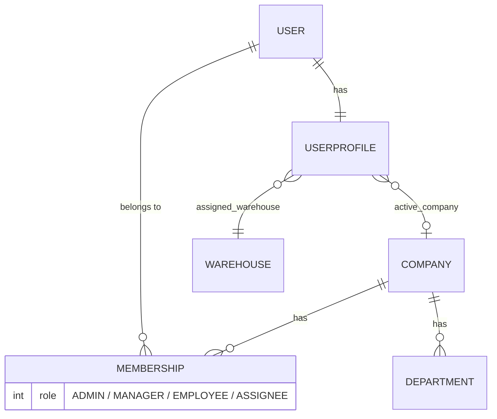
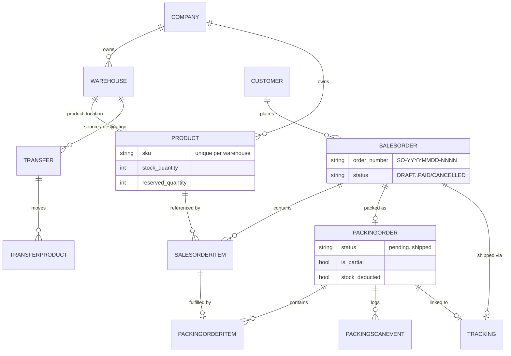
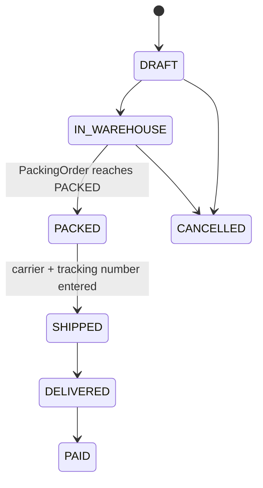

# Architecture

## Overview

OrganizedCompany is built as a **modular monolith**: a single Django project (`core/`) composed of ~14 independent apps, each owning one business domain. There's no microservice split and no SPA frontend — every app follows the same shape (`models.py`, `views.py`, `urls.py`, templates, static assets), which keeps navigation predictable across a fairly large domain (sales, inventory, warehousing, packing, shipping, staff, support).

A small REST API (Django REST Framework) sits alongside the server-rendered views to power JS-driven UI pieces (autocomplete, live order data) without turning the whole app into an API-first system.

## App Map

| App | Responsibility |
|---|---|
| `core` | Django project shell — settings, root URLconf, WSGI/ASGI entrypoints |
| `users` | Custom `User`, multi-tenant `Company` / `Membership`, `UserProfile`, `Department` — the identity & tenancy backbone |
| `mainapp` | Dashboard/home page, navigation, and a context processor injecting sidebar stats into every page |
| `sales` | `SalesOrder` lifecycle and `SalesOrderItem` line items |
| `inventory` | `Product` catalog — per-warehouse SKUs, stock/reserved quantities, images |
| `warehouse` | `Warehouse` entities (MAIN vs SHOP) |
| `packing` | Packing workflow: `PackingOrder`, `PackingOrderItem`, `PackingScanEvent`, barcode scanning UI, stock-reservation signals, PDF packing lists |
| `tracking` | `Tracking` — carrier, status, linked 1:1 to a `PackingOrder` |
| `transfers` | Inter-warehouse stock `Transfer` / `TransferProduct` |
| `customers` | `Customer` records |
| `staff` | Staff directory, department filters, admin-only staff onboarding |
| `helpcenter` | Internal support tickets (`HelpCenterTicket`, history, replies) |
| `api` | DRF endpoints: sales-order feed, product typeahead search |
| `contacts`, `reports`, `discussion` | Scaffolded, not yet implemented — see [Roadmap](#roadmap--not-yet-implemented) |

## Multi-Tenancy Model

`Company` is the tenant boundary. A `User` can belong to multiple companies through `Membership` (with a role per company), but every business object — `Product`, `SalesOrder`, `Warehouse`, `PackingOrder`, `Transfer`, `Tracking`, tickets — carries its own `company` foreign key. Views resolve the requesting user's company via `Membership` and filter every query by `company_id`, rather than relying on session-scoped globals. `UserProfile.assigned_warehouse` additionally scopes an employee to a specific warehouse, which is what the packing/reservation engine uses to decide where stock comes from (see [FEATURES.md](FEATURES.md)).

## Core Domain Model

Both `SalesOrderItem` and `PackingOrderItem` snapshot the product's `sku`/`name` at creation time (`resolved_sku` / `resolved_name` fall back to the snapshot if the `Product` FK is later nulled out by a delete). This keeps historical orders and packing lists readable even after a product is removed from the catalog.

## Order Lifecycle

The `SalesOrder.status` and its linked `PackingOrder.status` (`PENDING → IN_PROGRESS → PACKED → SHIPPED`) are kept in sync through Django signals rather than being driven from a single state machine — see [ENGINEERING_HIGHLIGHTS.md](ENGINEERING_HIGHLIGHTS.md) for a real bug this caused and how it was fixed.

## Roadmap / Not Yet Implemented

A few apps exist as scaffolding for planned features and are intentionally left out of the feature walkthrough:

- **`contacts`** — placeholder for a general contacts/CRM view
- **`reports`** — placeholder for analytics/reporting
- **`discussion`** — placeholder for internal team discussion/chat

These are visible in `INSTALLED_APPS` and have models/urls wired up, but no real business logic yet — listed here for transparency about current project scope rather than treated as bugs.
